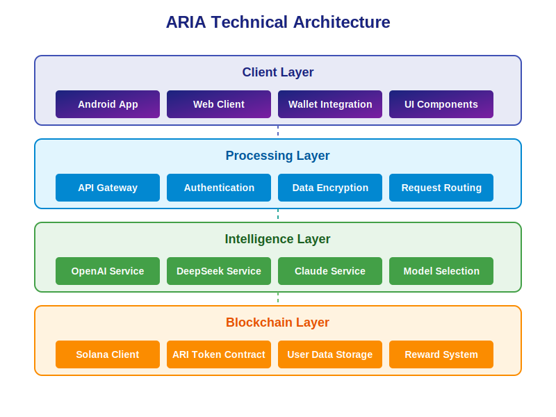
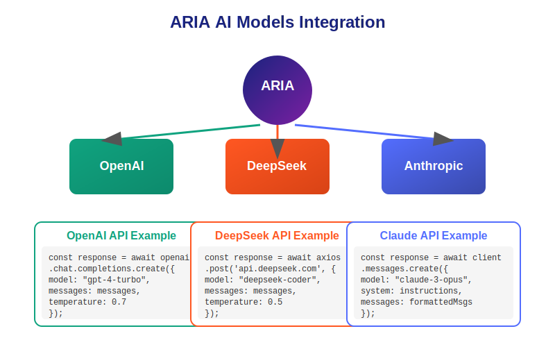

# ARIA - AI Personal Assistant on Solana

<div align="center">
  <a href="https://www.myaria.life">
    <picture>
      <source media="(prefers-color-scheme: dark)" srcset="assets/logo.svg">
      <source media="(prefers-color-scheme: light)" srcset="assets/logo.svg">
      
    </picture>
  </a>
</div>

[](https://opensource.org/licenses/MIT)
[](https://www.myaria.life/)
[](https://x.com/ARIA_Assistant)

ARIA is a decentralized AI personal assistant built on the Solana blockchain. The project integrates artificial intelligence capabilities with blockchain technology to create a privacy-focused, token-incentivized personal assistant accessible via Android and web applications.

## Overview

ARIA tackles two major challenges in the AI assistant space:
1. **Data Privacy**: Using Solana blockchain for secure, user-controlled data storage
2. **Value Distribution**: Rewarding users for their data contributions through the ARI token

The ARIA ecosystem is powered by the ARI token, which will be launched on pump.fun, a Solana-based token platform.

## Features

- **ARI Token**: SPL token on the Solana blockchain
- **Wallet Integration**: Connect to Solana wallets (Phantom, Solflare)
- **Token Dashboard**: View token balance and transaction history
- **AI Chat Interface**: Full-featured chat with GPT & DeepSeek LLM support
- **Data Sovereignty**: User-controlled data sharing
- **Cross-platform Support**: Android app and web interface

## Technical Architecture

<div align="center">
  
</div>

The ARIA system consists of four primary layers, each with specialized components that work together to provide a seamless user experience.

## Data Flow

<div align="center">
  
</div>

This diagram illustrates how data flows through the ARIA system, from user input to AI processing and back to user response.

## AI Models Integration

<div align="center">
  
</div>

ARIA integrates with multiple AI models to provide the best possible responses based on the specific user query context.

## Model API Integration Examples

ARIA seamlessly integrates with multiple leading AI language models through their APIs. Below are examples of how we implement these integrations:

### OpenAI GPT-4 Integration

```javascript
// backend/src/services/ai/openai.service.js
const { OpenAI } = require('openai');

class OpenAIService {
  constructor() {
    this.client = new OpenAI({
      apiKey: process.env.OPENAI_API_KEY,
    });
  }

  async generateResponse(userInput, context = [], systemPrompt = null) {
    try {
      const messages = [];
      
      // Add system prompt if provided
      if (systemPrompt) {
        messages.push({
          role: 'system',
          content: systemPrompt
        });
      } else {
        messages.push({
          role: 'system',
          content: 'You are ARIA, an AI assistant built on Solana blockchain. Be helpful, concise, and accurate.'
        });
      }
      
      // Add conversation context
      messages.push(...context);
      
      // Add current user input
      messages.push({
        role: 'user',
        content: userInput
      });

      // Call OpenAI API
      const response = await this.client.chat.completions.create({
        model: 'gpt-4-turbo',
        messages: messages,
        temperature: 0.7,
        max_tokens: 2048,
        top_p: 1,
        frequency_penalty: 0.2,
        presence_penalty: 0.5,
      });

      return {
        text: response.choices[0].message.content,
        model: 'gpt-4-turbo',
        provider: 'openai',
        tokenUsage: {
          input: response.usage.prompt_tokens,
          output: response.usage.completion_tokens,
          total: response.usage.total_tokens
        }
      };
    } catch (error) {
      console.error('OpenAI API Error:', error);
      throw new Error(`OpenAI service error: ${error.message}`);
    }
  }
}

module.exports = new OpenAIService();
```

### DeepSeek Integration

```javascript
// backend/src/services/ai/deepseek.service.js
const axios = require('axios');

class DeepSeekService {
  constructor() {
    this.apiKey = process.env.DEEPSEEK_API_KEY;
    this.apiEndpoint = 'https://api.deepseek.com/v1/chat/completions';
  }

  async generateResponse(userInput, context = [], systemPrompt = null) {
    try {
      const messages = [];
      
      // Add system prompt if provided
      if (systemPrompt) {
        messages.push({
          role: 'system',
          content: systemPrompt
        });
      } else {
        messages.push({
          role: 'system',
          content: 'You are ARIA, an AI assistant focused on blockchain and personal productivity.'
        });
      }
      
      // Add conversation context
      messages.push(...context);
      
      // Add current user input
      messages.push({
        role: 'user',
        content: userInput
      });

      // Call DeepSeek API
      const response = await axios.post(
        this.apiEndpoint,
        {
          model: 'deepseek-coder',
          messages: messages,
          temperature: 0.5,
          max_tokens: 1024,
          top_p: 1,
        },
        {
          headers: {
            'Content-Type': 'application/json',
            'Authorization': `Bearer ${this.apiKey}`
          }
        }
      );

      // Extract response data
      const responseData = response.data;
      
      return {
        text: responseData.choices[0].message.content,
        model: 'deepseek-coder',
        provider: 'deepseek',
        tokenUsage: {
          input: responseData.usage.prompt_tokens,
          output: responseData.usage.completion_tokens,
          total: responseData.usage.total_tokens
        }
      };
    } catch (error) {
      console.error('DeepSeek API Error:', error);
      throw new Error(`DeepSeek service error: ${error.message}`);
    }
  }
}

module.exports = new DeepSeekService();
```

### Anthropic Claude Integration

```javascript
// backend/src/services/ai/anthropic.service.js
const { Anthropic } = require('@anthropic-ai/sdk');

class AnthropicService {
  constructor() {
    this.client = new Anthropic({
      apiKey: process.env.ANTHROPIC_API_KEY,
    });
  }

  async generateResponse(userInput, context = [], systemPrompt = null) {
    try {
      // Format context into Claude-friendly format
      let formattedMessages = [];
      let currentRole = null;
      let currentContent = '';
      
      // Add system prompt if provided
      const systemInstructions = systemPrompt || 
        'You are ARIA, an AI assistant that specializes in blockchain technology, particularly Solana.';
      
      // Process conversation context
      for (const message of context) {
        // Handle role changes and accumulate content
        if (currentRole && message.role !== currentRole) {
          formattedMessages.push({ role: currentRole, content: currentContent });
          currentContent = message.content;
          currentRole = message.role;
        } else {
          currentRole = currentRole || message.role;
          currentContent = currentContent ? currentContent + '\n' + message.content : message.content;
        }
      }
      
      // Add accumulated context if any
      if (currentRole && currentContent) {
        formattedMessages.push({ role: currentRole, content: currentContent });
      }
      
      // Add current user input
      formattedMessages.push({ role: 'user', content: userInput });

      // Call Anthropic API
      const response = await this.client.messages.create({
        model: 'claude-3-opus-20240229',
        system: systemInstructions,
        messages: formattedMessages,
        temperature: 0.3,
        max_tokens: 4096,
        top_p: 0.95,
      });

      return {
        text: response.content[0].text,
        model: 'claude-3-opus',
        provider: 'anthropic',
        tokenUsage: {
          input: response.usage.input_tokens,
          output: response.usage.output_tokens,
          total: response.usage.input_tokens + response.usage.output_tokens
        }
      };
    } catch (error) {
      console.error('Anthropic API Error:', error);
      throw new Error(`Anthropic service error: ${error.message}`);
    }
  }
}

module.exports = new AnthropicService();
```

## Key Code Snippets

### 1. Solana Wallet Integration (Android)

```kotlin
// app/app/src/main/java/com/aria/app/wallet/SolanaWalletAdapter.kt
package com.aria.app.wallet

import android.util.Log
import com.aria.app.models.WalletAccount
import com.aria.app.models.WalletTransaction
import com.solana.core.PublicKey
import com.solana.mobilewalletadapter.clientlib.ActivityResultSender
import com.solana.mobilewalletadapter.clientlib.MobileWalletAdapter
import com.solana.mobilewalletadapter.clientlib.TransactionResult
import kotlinx.coroutines.Dispatchers
import kotlinx.coroutines.withContext
import kotlin.coroutines.resume
import kotlin.coroutines.resumeWithException
import kotlin.coroutines.suspendCoroutine

class SolanaWalletAdapter(
    private val activityResultSender: ActivityResultSender
) {
    private val TAG = "SolanaWalletAdapter"
    private val walletAdapter = MobileWalletAdapter(
        activityResultSender,
        "ARIA", // App identity name
        "https://www.myaria.life", // App identity URI
        "ARIA AI Assistant on Solana" // App identity icon URL
    )
    
    private var connectedPublicKey: PublicKey? = null
    
    /**
     * Connect to a Solana wallet using Mobile Wallet Adapter
     * @return WalletAccount with connection details
     */
    suspend fun connect(): WalletAccount = withContext(Dispatchers.IO) {
        suspendCoroutine { continuation ->
            walletAdapter.connect { result ->
                when(result) {
                    is TransactionResult.Success -> {
                        val publicKey = PublicKey(result.payload.publicKey)
                        connectedPublicKey = publicKey
                        val walletAccount = WalletAccount(
                            address = publicKey.toBase58(),
                            label = result.payload.accountLabel ?: "Solana Wallet",
                            iconUri = result.payload.walletUriBase?.toString(),
                            authToken = result.payload.authToken
                        )
                        Log.d(TAG, "Connected to wallet: ${publicKey.toBase58()}")
                        continuation.resume(walletAccount)
                    }
                    is TransactionResult.Failure -> {
                        Log.e(TAG, "Failed to connect wallet: ${result.error}")
                        continuation.resumeWithException(Exception("Failed to connect wallet: ${result.error}"))
                    }
                    else -> {
                        Log.e(TAG, "Unknown error connecting wallet")
                        continuation.resumeWithException(Exception("Unknown error connecting wallet"))
                    }
                }
            }
        }
    }
    
    /**
     * Sign and send a transaction
     * @param transaction Base64 encoded serialized transaction
     * @return Transaction signature
     */
    suspend fun signAndSendTransaction(transaction: String): String = withContext(Dispatchers.IO) {
        suspendCoroutine { continuation ->
            walletAdapter.signAndSendTransactions(
                listOf(transaction.toByteArray())
            ) { result ->
                when(result) {
                    is TransactionResult.Success -> {
                        val signature = result.payload.signatures[0].toString()
                        Log.d(TAG, "Transaction signed and sent: $signature")
                        continuation.resume(signature)
                    }
                    is TransactionResult.Failure -> {
                        Log.e(TAG, "Failed to sign transaction: ${result.error}")
                        continuation.resumeWithException(Exception("Failed to sign transaction: ${result.error}"))
                    }
                    else -> {
                        Log.e(TAG, "Unknown error signing transaction")
                        continuation.resumeWithException(Exception("Unknown error signing transaction"))
                    }
                }
            }
        }
    }
    
    /**
     * Sign a message with the connected wallet
     * @param message Message to sign
     * @return Signature as Base64 string
     */
    suspend fun signMessage(message: String): String = withContext(Dispatchers.IO) {
        suspendCoroutine { continuation ->
            walletAdapter.signMessages(
                addresses = listOf(connectedPublicKey?.toByteArray() ?: ByteArray(0)),
                payloads = listOf(message.toByteArray())
            ) { result ->
                when(result) {
                    is TransactionResult.Success -> {
                        val signature = result.payload.signatures[0].toString()
                        Log.d(TAG, "Message signed: $signature")
                        continuation.resume(signature)
                    }
                    is TransactionResult.Failure -> {
                        Log.e(TAG, "Failed to sign message: ${result.error}")
                        continuation.resumeWithException(Exception("Failed to sign message: ${result.error}"))
                    }
                    else -> {
                        Log.e(TAG, "Unknown error signing message")
                        continuation.resumeWithException(Exception("Unknown error signing message"))
                    }
                }
            }
        }
    }
    
    /**
     * Disconnect from the wallet
     */
    fun disconnect() {
        walletAdapter.disconnect()
        connectedPublicKey = null
    }
}
```

### 2. ARI Token Contract (Rust)

```rust
// contract/src/lib.rs
use solana_program::{
    account_info::{next_account_info, AccountInfo},
    entrypoint,
    entrypoint::ProgramResult,
    msg,
    program::{invoke, invoke_signed},
    program_error::ProgramError,
    program_pack::Pack,
    pubkey::Pubkey,
    rent::Rent,
    system_instruction,
    sysvar::Sysvar,
};
use spl_token::{
    instruction as token_instruction,
    state::{Account as TokenAccount, Mint},
};
use std::convert::TryInto;

// Program entry point
entrypoint!(process_instruction);

pub fn process_instruction(
    program_id: &Pubkey,
    accounts: &[AccountInfo],
    instruction_data: &[u8],
) -> ProgramResult {
    if instruction_data.is_empty() {
        return Err(ProgramError::InvalidInstructionData);
    }

    let instruction = instruction_data[0];
    let instruction_data = &instruction_data[1..];

    match instruction {
        0 => initialize_token_mint(program_id, accounts, instruction_data),
        1 => mint_tokens(program_id, accounts, instruction_data),
        2 => transfer_authority(program_id, accounts, instruction_data),
        _ => Err(ProgramError::InvalidInstructionData),
    }
}

// Initialize a new token mint
fn initialize_token_mint(
    program_id: &Pubkey,
    accounts: &[AccountInfo],
    _instruction_data: &[u8],
) -> ProgramResult {
    let accounts_iter = &mut accounts.iter();
    
    // Extract accounts
    let authority_account = next_account_info(accounts_iter)?;
    let mint_account = next_account_info(accounts_iter)?;
    let rent_account = next_account_info(accounts_iter)?;
    let token_program = next_account_info(accounts_iter)?;

    // Verify authority is signer
    if !authority_account.is_signer {
        return Err(ProgramError::MissingRequiredSignature);
    }
    
    // Extract rent sysvar
    let rent = &Rent::from_account_info(rent_account)?;
    
    // Initialize mint account
    invoke(
        &token_instruction::initialize_mint(
            token_program.key,
            mint_account.key,
            authority_account.key,
            Some(authority_account.key), // Freeze authority (optional)
            9,  // 9 decimals
        )?,
        &[
            mint_account.clone(),
            rent_account.clone(),
            authority_account.clone(),
        ],
    )?;
    
    msg!("ARI token mint initialized");
    Ok(())
}

// Mint tokens to a destination account
fn mint_tokens(
    program_id: &Pubkey,
    accounts: &[AccountInfo],
    instruction_data: &[u8],
) -> ProgramResult {
    let accounts_iter = &mut accounts.iter();
    
    // Extract accounts
    let authority_account = next_account_info(accounts_iter)?;
    let mint_account = next_account_info(accounts_iter)?;
    let destination_account = next_account_info(accounts_iter)?;
    let token_program = next_account_info(accounts_iter)?;
    
    // Verify authority is signer
    if !authority_account.is_signer {
        return Err(ProgramError::MissingRequiredSignature);
    }
    
    // Parse mint amount
    if instruction_data.len() != 8 {
        return Err(ProgramError::InvalidInstructionData);
    }
    let amount = instruction_data
        .get(0..8)
        .and_then(|slice| slice.try_into().ok())
        .map(u64::from_le_bytes)
        .ok_or(ProgramError::InvalidInstructionData)?;
    
    // Mint tokens to destination
    invoke(
        &token_instruction::mint_to(
            token_program.key,
            mint_account.key,
            destination_account.key,
            authority_account.key,
            &[],
            amount,
        )?,
        &[
            mint_account.clone(),
            destination_account.clone(),
            authority_account.clone(),
        ],
    )?;
    
    msg!("Minted {} tokens", amount);
    Ok(())
}

// Transfer mint authority to a new account
fn transfer_authority(
    program_id: &Pubkey,
    accounts: &[AccountInfo],
    _instruction_data: &[u8],
) -> ProgramResult {
    let accounts_iter = &mut accounts.iter();
    
    // Extract accounts
    let current_authority = next_account_info(accounts_iter)?;
    let mint_account = next_account_info(accounts_iter)?;
    let new_authority = next_account_info(accounts_iter)?;
    let token_program = next_account_info(accounts_iter)?;
    
    // Verify current authority is signer
    if !current_authority.is_signer {
        return Err(ProgramError::MissingRequiredSignature);
    }
    
    // Transfer mint authority
    invoke(
        &token_instruction::set_authority(
            token_program.key,
            mint_account.key,
            Some(new_authority.key),
            spl_token::instruction::AuthorityType::MintTokens,
            current_authority.key,
            &[],
        )?,
        &[
            mint_account.clone(),
            current_authority.clone(),
        ],
    )?;
    
    msg!("Mint authority transferred to: {}", new_authority.key);
    Ok(())
}
```

### 3. AI Response Processing (Node.js)

```javascript
// backend/src/controllers/chat.controller.js
const OpenAIService = require('../services/ai/openai.service');
const DeepSeekService = require('../services/ai/deepseek.service');
const AnthropicService = require('../services/ai/anthropic.service');
const ConversationService = require('../services/conversation.service');
const { enrichPromptWithUserData } = require('../utils/prompt.utils');
const { detectIntent, getResponseType } = require('../utils/intent.utils');

/**
 * Handles AI chat requests and selects appropriate model based on content
 */
exports.processChat = async (req, res) => {
  try {
    const { message, conversationId } = req.body;
    const userId = req.user.id;
    
    if (!message) {
      return res.status(400).json({ error: 'Message is required' });
    }
    
    // Get or create conversation
    const conversation = await ConversationService.getOrCreateConversation(
      userId, 
      conversationId
    );
    
    // Get conversation history (limited to last 10 messages)
    const history = await ConversationService.getConversationHistory(
      conversation.id,
      10
    );
    
    // Format history for AI context
    const formattedHistory = history.map(msg => ({
      role: msg.isUser ? 'user' : 'assistant',
      content: msg.content
    }));
    
    // Detect intent and select appropriate model
    const intent = detectIntent(message);
    const responseType = getResponseType(intent);
    
    // Enrich prompt with user data if necessary
    const enhancedMessage = await enrichPromptWithUserData(message, userId, intent);
    
    // Select appropriate model based on intent and response type
    let response;
    switch(responseType) {
      case 'code':
        // Use DeepSeek for code-related queries
        response = await DeepSeekService.generateResponse(
          enhancedMessage,
          formattedHistory,
          'You are ARIA, a helpful assistant specialized in programming and blockchain technology. Provide concise, accurate code examples when appropriate.'
        );
        break;
        
      case 'reasoning':
        // Use Claude for complex reasoning
        response = await AnthropicService.generateResponse(
          enhancedMessage,
          formattedHistory,
          'You are ARIA, an AI assistant with strong reasoning capabilities. Think step by step and provide clear, logical explanations.'
        );
        break;
        
      case 'general':
      default:
        // Use OpenAI as default
        response = await OpenAIService.generateResponse(
          enhancedMessage,
          formattedHistory
        );
    }
    
    // Save user message and AI response
    await ConversationService.saveMessage(conversation.id, userId, enhancedMessage, true);
    await ConversationService.saveMessage(conversation.id, null, response.text, false, {
      model: response.model,
      provider: response.provider,
      tokenUsage: response.tokenUsage
    });
    
    // Return response with metadata
    return res.json({
      id: conversation.id,
      message: response.text,
      model: response.model,
      provider: response.provider
    });
    
  } catch (error) {
    console.error('Error in chat processing:', error);
    return res.status(500).json({ error: 'An error occurred while processing your request' });
  }
};
```

## Project Milestones

| Phase | Timeline | Milestones | Status |
|-------|----------|------------|--------|
| **Phase 1: Foundation** | October - December 2024 | • Initial token contract development<br>• Repository setup and architecture design<br>• Basic wallet integration<br>• Documentation foundation | ✅ Completed |
| **Phase 2: Core Development** | January - March 2025 | • Android app UI implementation<br>• Backend API development<br>• Multi-model AI integration<br>• Data encryption implementation | 🔄 In Progress |
| **Phase 3: DApp Construction** | February - April 2025 | • Solana transaction handling<br>• Token wallet dashboard<br>• User authentication system<br>• Data privacy controls | 🔄 In Progress |
| **Phase 4: Advanced Features** | May - July 2025 | • AI fine-tuning with user feedback<br>• Decentralized storage integration<br>• Community governance implementation<br>• Recommendation engine | 📅 Planned |
| **Phase 5: Public Release** | August - September 2025 | • Security audits<br>• Performance optimization<br>• Token launch on pump.fun<br>• Marketing and community building | 📅 Planned |

The project is currently in Phase 3 (DApp Construction), with significant progress made in implementing the core blockchain functionality and smart contract integration. The development team is focused on ensuring seamless interaction between the AI components and blockchain infrastructure.

## Repository Structure

```
ARIA/
│
├── README.md                    # Project overview and documentation
├── LICENSE                      # MIT license
├── PROJECT_SUMMARY.md           # Project summary
├── DATE_UPDATE_REPORT.md        # Date update report
├── GITHUB_SETUP.md              # GitHub setup guide
├── docker-compose.yml           # Docker configuration
│
├── .github/                     # GitHub related configuration
│   └── workflows/               # GitHub Actions workflows
│       └── ci.yml               # CI/CD pipeline configuration
│
├── assets/                      # Static assets
│   ├── logo.svg                 # Project logo
│   └── diagrams/                # Diagrams directory
│       ├── architecture.svg     # Architecture diagram
│       ├── data-flow.svg        # Data flow diagram
│       └── models-integration.svg # AI models integration diagram
│
├── docs/                        # Documentation directory
│   ├── whitepaper.md            # Whitepaper
│   ├── tokenomics.md            # Token economics
│   ├── installation.md          # Installation guide
│   ├── security_audit.md        # Security audit
│   ├── index.md                 # Documentation index
│   ├── android_architecture.md  # Android architecture document
│   └── en/                      # English documentation
│
├── app/                         # Android application
│   ├── build.gradle             # Project-level build file
│   ├── settings.gradle          # Project settings
│   └── app/                     # App module
│       ├── build.gradle         # App-level build file
│       ├── proguard-rules.pro   # Proguard rules
│       └── src/
│           └── main/
│               ├── java/com/aria/app/  # Main code directory
│               │   ├── ARIAApplication.kt   # Application class
│               │   ├── ui/             # UI components
│               │   │   ├── MainActivity.kt  # Main activity
│               │   │   └── settings/   # Settings screens
│               │   │       ├── LanguageSelectionScreen.kt  # Language selection screen
│               │   │       ├── LanguageSettingsViewModel.kt # Language settings view model
│               │   │       ├── SettingsScreen.kt    # Settings screen
│               │   │       └── SettingsViewModel.kt # Settings view model
│               │   └── utils/          # Utility classes
│               │       └── LocaleHelper.kt    # Language settings helper
│               ├── res/                # Resource files
│               │   ├── values/         # Default resource values
│               │   │   └── strings.xml # String resources
│               │   ├── values-zh/      # Chinese resources
│               │   │   └── strings.xml # Chinese string resources
│               │   ├── values-es/      # Spanish resources (placeholder)
│               │   ├── values-fr/      # French resources (placeholder)
│               │   └── values-ja/      # Japanese resources (placeholder)
│               └── AndroidManifest.xml # App manifest
│
├── backend/                     # Node.js backend server
│   ├── package.json             # NPM dependencies
│   └── src/                     # Server-side code
│       ├── controllers/         # API controllers
│       │   ├── user.controller.js
│       │   ├── token.controller.js
│       │   └── solana.controller.js
│       ├── routes/              # API routes
│       ├── middleware/          # Express middleware
│       ├── services/            # Service layer
│       │   └── ai/              # AI services
│       │       ├── openai.service.js   # OpenAI integration
│       │       ├── deepseek.service.js # DeepSeek integration
│       │       └── anthropic.service.js # Anthropic integration
│       ├── utils/               # Utility functions
│       └── index.js             # Server entry point
│
├── frontend/                    # Web frontend (React)
│   ├── package.json             # NPM dependencies
│   ├── public/                  # Static assets
│   └── src/                     # React components and logic
│       ├── components/          # UI components
│       ├── pages/               # Page components
│       │   └── DashboardPage.js # Dashboard page
│       ├── services/            # Services
│       └── utils/               # Utility functions
│
├── contract/                    # Solana smart contracts
│   ├── Cargo.toml               # Rust dependencies
│   ├── README.md                # Contract documentation
│   └── src/                     # Contract source code
│       └── lib.rs               # Token contract implementation
│
├── server/                      # Other server components
│
└── scripts/                     # Scripts directory
    ├── deploy_token.js          # Token deployment script
    ├── pump_fun_listing.js      # pump.fun listing script
    ├── test_token_devnet.js     # Devnet test script
    └── temp/                    # Temporary files
```

## Getting Started

### Prerequisites

- Node.js (v14+)
- Rust and Cargo (latest stable)
- Solana CLI tools (v1.16+)
- Android Studio (latest version)
- Docker & Docker Compose (optional)
- Phantom or Solflare wallet

### Installation and Setup

#### 1. Clone the repository
```bash
git clone https://github.com/yourusername/ARIA.git
cd ARIA
```

#### 2. Deploy the ARI token (for development)
```bash
# Install dependencies
cd scripts
npm install

# Deploy token to Solana devnet
node deploy_token.js
```

#### 3. Set up the backend server
```bash
# Navigate to backend directory
cd ../backend

# Install dependencies
npm install

# Copy example environment file
cp .env.example .env

# Customize environment variables in .env file
# Start the server
npm run dev
```

#### 4. Run the web frontend (optional)
```bash
# Navigate to frontend directory
cd ../frontend

# Install dependencies
npm install

# Start development server
npm start
```

#### 5. Build and run the Android app
```bash
# Navigate to app directory
cd ../app

# Open with Android Studio or build directly
./gradlew installDebug
```

#### 6. Using Docker (alternative)
```bash
# From project root
docker-compose up
```

## Token Economics

The ARI token is the backbone of the ARIA ecosystem:

- **Name**: ARI (ARIA Token)
- **Type**: SPL Token on Solana
- **Total Supply**: 100,000,000 ARI
- **Decimals**: 9

### Distribution

- **50%** - User incentives (rewards and airdrops)
- **20%** - Development team and operations
- **20%** - Community governance and ecosystem
- **10%** - Marketing and partnerships

### Utility

- **Data Contribution Rewards**: Users earn tokens by contributing anonymous data
- **Premium Feature Access**: Unlock advanced features by staking tokens
- **Governance Participation**: Vote on project development priorities
- **Network Fee Discounts**: Receive discounts on transaction fees

## Testing

For testing purposes, the project includes:

1. Unit tests for key components
2. Integration tests for API endpoints
3. Mock implementations for development without external dependencies

Run tests with:
```bash
# Backend tests
cd backend
npm test

# Android tests (using Android Studio or Gradle)
cd app
./gradlew test
```

## Contributing

Contributions are welcome! Please feel free to submit a Pull Request.

1. Fork the project
2. Create your feature branch (`git checkout -b feature/amazing-feature`)
3. Commit your changes (`git commit -m 'Add some amazing feature'`)
4. Push to the branch (`git push origin feature/amazing-feature`)
5. Open a Pull Request

## License

This project is licensed under the MIT License - see the LICENSE file for details.

## Contact

For questions or support, please open an issue on this repository.

## Acknowledgements

- Solana Foundation
- SPL Token Program
- Jetpack Compose
- Mobile Wallet Adapter Protocol 